<!-- ══════════════════════════════════════════════════════════════════════ -->
<!--                    FARHAT ABBAS — GITHUB README                      -->
<!--          All section banners are animated SVG files in /assets/      -->
<!-- ══════════════════════════════════════════════════════════════════════ -->

<!-- ▓▓▓▓▓▓▓▓▓▓▓▓▓▓▓▓▓▓  HERO  ▓▓▓▓▓▓▓▓▓▓▓▓▓▓▓▓▓▓ -->
<div align="center">
  
</div>

<!-- ▓▓▓  TYPING ANIMATION  ▓▓▓ -->
<div align="center">
  
</div>

<br/>

<!-- ▓▓▓  BADGES ROW  ▓▓▓ -->
<div align="center">
  
  &nbsp;
  
  &nbsp;
  
  &nbsp;
  
</div>

<br/>

---

<!-- ▓▓▓▓▓▓▓▓▓▓▓▓▓▓▓▓▓▓  ABOUT  ▓▓▓▓▓▓▓▓▓▓▓▓▓▓▓▓▓▓ -->
<div align="center">
  
</div>

<br/>

---

<!-- ▓▓▓▓▓▓▓▓▓▓▓▓▓▓▓▓▓▓  3D ACTIVITY GRAPH  ▓▓▓▓▓▓▓▓▓▓▓▓▓▓▓▓▓▓ -->
## 📈 Contribution Activity

<div align="center">
  
</div>

<br/>

---

<!-- ▓▓▓▓▓▓▓▓▓▓▓▓▓▓▓▓▓▓  TROPHIES  ▓▓▓▓▓▓▓▓▓▓▓▓▓▓▓▓▓▓ --> 
## 🏆 GitHub Trophies


<div align="center">
  
  <!-- Animated trophy line using Shields.io badges -->
  
  
  
  
  
  
  

  <!-- Animated typing effect -->
  
</div>


<br/>

---

<!-- ▓▓▓▓▓▓▓▓▓▓▓▓▓▓▓▓▓▓  TECH STACK  ▓▓▓▓▓▓▓▓▓▓▓▓▓▓▓▓▓▓ -->
<div align="center">
  
</div>

<br/>

<div align="center">

### ⬡ Languages


### ⬡ Frameworks & Libraries


### ⬡ Tools & Platforms


</div>

<br/>

---

<!-- ▓▓▓▓▓▓▓▓▓▓▓▓▓▓▓▓▓▓  GITHUB STATS  ▓▓▓▓▓▓▓▓▓▓▓▓▓▓▓▓▓▓ -->
## 📊 GitHub Stats

<div align="center">
  
  &nbsp;&nbsp;
  
</div>

<br/>

<div align="center">
  
</div>

<br/>

---

<!-- ▓▓▓▓▓▓▓▓▓▓▓▓▓▓▓▓▓▓  PROJECTS  ▓▓▓▓▓▓▓▓▓▓▓▓▓▓▓▓▓▓ -->
<div align="center">
  
</div>

<br/>

<div align="center">
  
</div>

<br/>

<table>
<tr>
<td width="50%" valign="top">

### 🏛️ ME Section A Portal


Role-based student portal for ~48 students — Three.js 3D visuals, glassmorphism dark UI, real-time problem submission, and a 5-tier role hierarchy:

```
Super Admin › CR › GR › PR › Student
```

**Stack:** `JavaScript` · `Three.js` · `Node.js` · `HTML/CSS`

</td>
<td width="50%" valign="top">

### ✋ Gesture-Controlled Whiteboard


Digital whiteboard driven entirely by hand gestures — zero-touch teaching and presentation environments. Full Canvas API rendering pipeline via MediaPipe Hands.

**Stack:** `Python` · `MediaPipe Hands` · `Canvas API`

</td>
</tr>
<tr>
<td width="50%" valign="top">

### 📄 Engineering Doc Suite


Production-grade technical documents:
- EM-II Lab Reports (Flat Belt & V-Belt Friction)
- PRECIX Engineering MoM · Ref: `PEC/BOD/2026/Q2-01`
- Materials & Manufacturing Lab — colour-coded floor plan

**Stack:** `Node.js` · `docx` · `XML`

</td>
<td width="50%" valign="top">

### 🤖 Claude 101 Certificate — Enhanced


Completed Anthropic's official **Claude 101** AI fundamentals course. Took the plain completion certificate and redesigned it into a **luxury-styled HTML/CSS/SVG document** — professional typography, ornate signature blocks, and full visual refinement.

**Stack:** `HTML` · `CSS` · `SVG`

</td>
</tr>
</table>

<br/>

---

<!-- ▓▓▓▓▓▓▓▓▓▓▓▓▓▓▓▓▓▓  CERTIFICATION  ▓▓▓▓▓▓▓▓▓▓▓▓▓▓▓▓▓▓ -->
<div align="center">
  
</div>

<br/>

---

<!-- ▓▓▓▓▓▓▓▓▓▓▓▓▓▓▓▓▓▓  ROLES  ▓▓▓▓▓▓▓▓▓▓▓▓▓▓▓▓▓▓ -->
## 🏅 Roles & Affiliations

<div align="center">

| | Role | Organization | Scope |
|:---:|:---|:---|:---|
| 🔑 | **Class Super Admin** | ME Section A — UET Lahore | Portal management & class operations for Batch 2025 (~48 students) |
| 🔬 | **Team Documentation** | Science Society — UET Lahore | Handles reports, documentation & written communications for the society |
| 🏗️ | **Technical Writer** | PRECIX Engineering | Formal engineering documents, MoM (ISO 9001:2015), professional records |

</div>

<br/>

---

<!-- ▓▓▓▓▓▓▓▓▓▓▓▓▓▓▓▓▓▓  WHAT I WORK ON  ▓▓▓▓▓▓▓▓▓▓▓▓▓▓▓▓▓▓ -->
## 📚 What I Work On

<div align="center">

### ⚡ Core Competencies

| Category | Technologies |
|----------|--------------|
| 🔩 **Mechanical Systems** | `EM-II` `Materials` `Manufacturing Lab` |
| 💻 **Web Development** | `Portals` `Dev Tools` `Full-Stack Apps` |
| 📄 **Technical Writing** | `Reports` `Memos` `Minutes of Meeting` `Proposals` |
| 🎨 **UI/Visual Design** | `Glassmorphism` `3D Interfaces` `Modern UI` |
| 🤖 **AI & Automation** | `Prompt Engineering` `Claude AI` `LLM Integration` |
| ⚙️ **Scripting** | `Python` `JavaScript` `Node.js` |

<!-- Animated separator -->


</div>

<br/>

---

<!-- ▓▓▓▓▓▓▓▓▓▓▓▓▓▓▓▓▓▓  INTERESTS  ▓▓▓▓▓▓▓▓▓▓▓▓▓▓▓▓▓▓ -->
## 📈 Interests

<div align="center">

| 🔩 Technical Design | 💻 Software Builds | 📄 Professional Documentation | 🤖 AI & Prompt Engineering |
|:---:|:---:|:---:|:---:|
|  |  |  |  |

</div>

<br/>

---

<!-- ▓▓▓▓▓▓▓▓▓▓▓▓▓▓▓▓▓▓  LANGUAGES  ▓▓▓▓▓▓▓▓▓▓▓▓▓▓▓▓▓▓ -->
## 💬 Languages

<div align="center">


</div>

<br/>

---

<!-- ▓▓▓▓▓▓▓▓▓▓▓▓▓▓▓▓▓▓  CURRENTLY  ▓▓▓▓▓▓▓▓▓▓▓▓▓▓▓▓▓▓ -->
## 🟢 Currently

<div align="center">
  
</div>

<br/>

---

<!-- ▓▓▓▓▓▓▓▓▓▓▓▓▓▓▓▓▓▓  CONNECT  ▓▓▓▓▓▓▓▓▓▓▓▓▓▓▓▓▓▓ -->
<div align="center">
  
</div>

<br/>

<div align="center">

[](https://linkedin.com/in/YOUR_LINKEDIN)
&nbsp;
[](mailto:YOUR_EMAIL)
&nbsp;
[](https://uet.edu.pk)

</div>

<br/>

<!-- ▓▓▓▓▓▓▓▓▓▓▓▓▓▓▓▓▓▓  FOOTER  ▓▓▓▓▓▓▓▓▓▓▓▓▓▓▓▓▓▓ -->
<div align="center">
  
</div>
